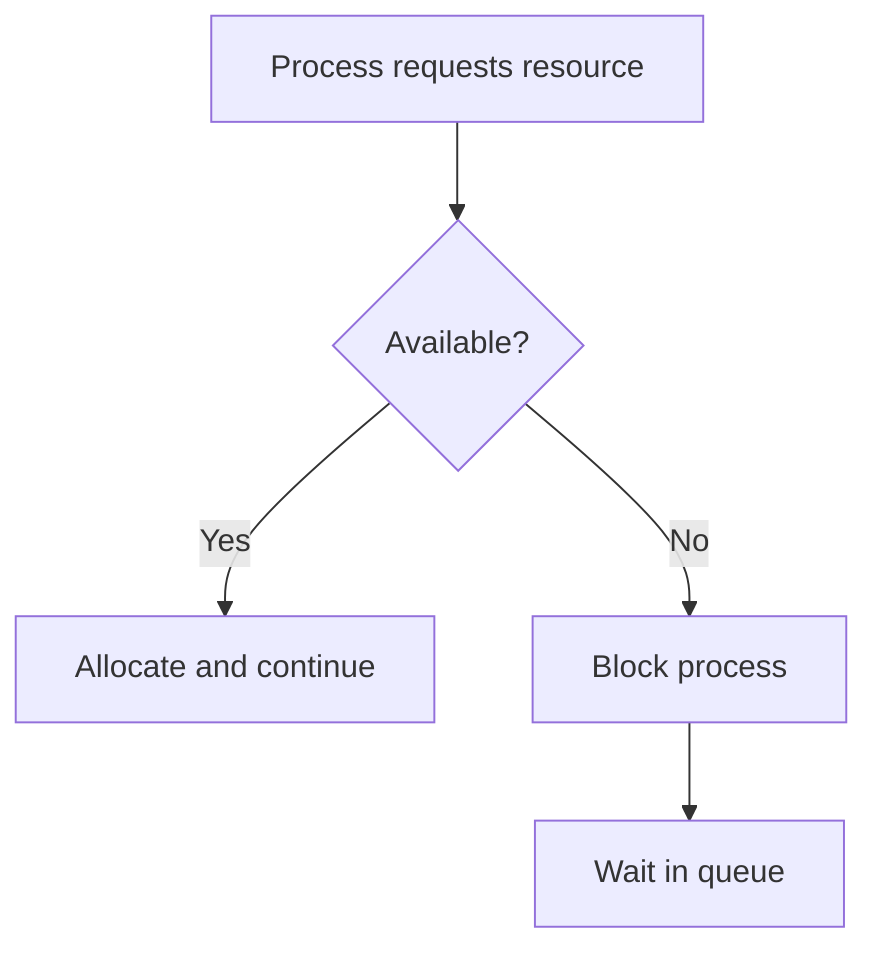
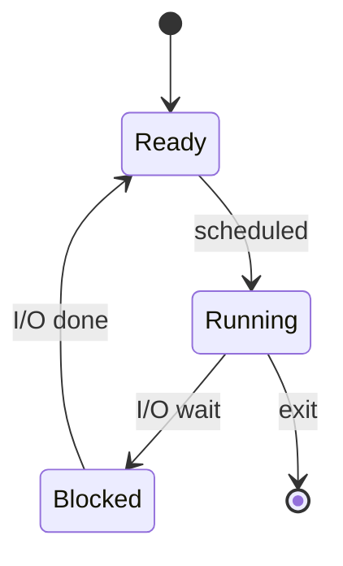

# Mermaid Chat Diagrams Implementation Plan

> **For agentic workers:** REQUIRED SUB-SKILL: Use superpowers:subagent-driven-development (recommended) or superpowers:executing-plans to implement this plan task-by-task. Steps use checkbox (`- [ ]`) syntax for tracking.

**Goal:** Make the RAG assistant answer with inline Mermaid diagrams (flowcharts, sequence, state machines), branded to Project RAG.

**Architecture:** The frontend already renders ` ```mermaid ` blocks via the existing `MermaidDiagram` component (streaming-safe, auto-repair, fullscreen). The feature is therefore two changes: (1) make the n8n RAG Query answer model *emit* a `mermaid` block on a hybrid trigger, and (2) a one-file branding tweak to the renderer. No backend/DB/sandbox/artifact work.

**Tech Stack:** Next.js 15 (App Router), TypeScript, Radix Themes, `mermaid@^11.15.0`, `react-markdown`; n8n for RAG (workflow `RAG Query`, id `H4WL7om1JO3UmavC`); answer model `glm-4.6`.

**Spec:** `docs/superpowers/specs/2026-06-28-mermaid-chat-diagrams-design.md`

## Global Constraints

- Commit style: **plain one-line messages, no conventional-commit prefixes, no attribution lines, do not name the upstream project in commit messages.** One commit per file.
- App is branded **"Project RAG"**; inline English literals only (no i18n).
- **Frontend verification:** `cd frontend && npx tsc --noEmit` (must exit 0) and `npm run lint` (clean). No React component test harness — verify UI behavior manually in `npm run dev`.
- **n8n edits:** the workflow MUST be **closed in the n8n editor** before editing via MCP (the editor's save silently overwrites API edits). n8n flows aren't unit-testable — verification is **integration-style**. The n8n change is applied via the editor/MCP, **not git**.
- Match surrounding code style; keep diffs minimal and focused.

---

### Task 1: Emit Mermaid from the n8n RAG Query answer prompt

This is the whole feature's "feed". After this task, asking the assistant to draw something produces a diagram that renders inline with the existing (stock-colored) renderer — a working, demoable increment. Branding comes in Task 2.

**Files:**
- Modify (via n8n MCP, not git): n8n `RAG Query` workflow (id `H4WL7om1JO3UmavC`) — the answer-synthesis node's system prompt.

**Interfaces:**
- Consumes: nothing (first task).
- Produces: assistant answers that may contain exactly one ` ```mermaid ` fenced block. Task 2 relies only on diagrams rendering — no shared code symbols.

- [ ] **Step 1: Ensure the workflow is closed in the n8n editor**

Open the n8n UI and confirm the `RAG Query` workflow is **not** open in an editor tab (close it if it is). Editor saves silently overwrite API/MCP edits.

- [ ] **Step 2: Fetch the workflow and locate the answer-synthesis node**

Use the n8n MCP `get_workflow_details` tool with workflow id `H4WL7om1JO3UmavC`. Identify the node that synthesizes the **final answer** from the retrieved context — an LLM / AI-Agent / "message a model" node whose prompt instructs it to answer the user's question using the provided document/web context (it produces the streamed answer text, not the retrieval or the title step).

Record the node name and the exact parameter that holds its system prompt (e.g. the agent's system message, or the chat model's `messages`/`system` field).

Expected: you can point to one node and one prompt string.

- [ ] **Step 3: Append the diagram guidance to that node's system prompt**

Leave the existing prompt intact. Insert the following section before the `Document context:` block (this is copied from the spec; the two few-shot examples anchor correct syntax for the answer model `glm-4.6`):

```
Diagrams. When a process, algorithm, sequence of steps, state machine, or set of relationships would be clearer drawn — or whenever the user asks you to draw / diagram / visualize / flowchart something — include exactly one Mermaid diagram in a ```mermaid fenced code block, in addition to a short text explanation (never instead of it). Do not add a diagram for plain factual or conversational answers.

Rules: use valid Mermaid v11 syntax; keep it focused (no more than ~15 nodes); prefer flowchart, sequenceDiagram, or stateDiagram-v2. Do not put markdown links or @ characters inside node labels. Keep node text short.

Example (process flow):


Example (state machine):

```

Apply the edit with the n8n MCP update flow: read the SDK reference if needed (`get_sdk_reference`), update the node's prompt parameter, then `validate_workflow`. Do not change any other node, wiring, or parameter.

- [ ] **Step 4: Validate and publish**

Run `validate_workflow` via MCP and fix any reported errors until it passes. Then publish/activate the workflow (`publish_workflow` or the equivalent update+activate) so the live `RAG Query` uses the new prompt.

Expected: validation passes; the workflow is active.

- [ ] **Step 5: Integration verification (the 4 spec scenarios)**

In the running app (`cd frontend && npm run dev` if not already up), send these and observe:

1. **Explicit ask** — "draw a flowchart of the producer–consumer algorithm" → a flowchart renders inline.
2. **Proactive** — "explain the process state lifecycle" → a diagram appears alongside the text (hybrid trigger fired without an explicit "draw").
3. **Negative** — "what is a semaphore?" → a plain text answer with **no** diagram (confirm diagrams aren't spammed onto every answer).
4. **Resilience** — a long/awkward request likely to produce messy syntax → if Mermaid is invalid, the amber "Could not render diagram" banner appears with a "show source" toggle; the answer text is intact.

If scenario 2 never diagrams or scenario 3 always diagrams, tighten the "when to diagram" wording in Step 3 and re-publish.

- [ ] **Step 6: Record the change**

No git commit (n8n lives outside git). Note in the PR/branch description or `STATUS.md` that the `RAG Query` answer prompt now emits Mermaid on a hybrid trigger.

---

### Task 2: Brand the Mermaid renderer (jade theme + fingerprint removal + caption)

One file, one commit. Diagrams already render (Task 1), so every change here is directly verifiable against a real diagram.

**Files:**
- Modify: `frontend/app/(main)/chat/components/message-area/mermaid-diagram.tsx`

**Interfaces:**
- Consumes: diagrams emitted by Task 1 (for manual verification only — no code dependency).
- Produces: no new exported symbols; `MermaidDiagram`'s public props (`{ chart: string }`) are unchanged.

- [ ] **Step 1: Brand the theme in `ensureInit()`**

Replace the comment block above `ensureInit` (currently begins "Always use mermaid's 'default' (light) theme") and the `mermaid.initialize({...})` call. Find:

```ts
/**
 * Always use mermaid's 'default' (light) theme so that node fills, borders,
 * and text colours render correctly. Arrow/line visibility in dark mode is
 * handled by giving the diagram container a fixed white background (below).
 */
let mermaidInitPromise: Promise<void> | null = null;

function ensureInit(): Promise<void> {
  if (mermaidInitPromise) return mermaidInitPromise;

  mermaidInitPromise = import('mermaid').then(({ default: mermaid }) => {
    mermaid.initialize({
      startOnLoad: false,
      theme: 'default',
      securityLevel: 'antiscript',
      fontFamily: 'inherit',
    });
  });

  return mermaidInitPromise;
}
```

Replace with:

```ts
/**
 * Render with mermaid's 'base' theme plus Project RAG's jade themeVariables so
 * diagrams are branded (node fills, borders, edges). This stays a light-base
 * render; dark-mode legibility is handled separately by injectDarkEdgeStyles().
 */
let mermaidInitPromise: Promise<void> | null = null;

function ensureInit(): Promise<void> {
  if (mermaidInitPromise) return mermaidInitPromise;

  mermaidInitPromise = import('mermaid').then(({ default: mermaid }) => {
    mermaid.initialize({
      startOnLoad: false,
      theme: 'base',
      securityLevel: 'antiscript',
      fontFamily: 'inherit',
      // Project RAG jade accent (Radix jade / olive, light base).
      themeVariables: {
        primaryColor: '#e7f6ef',
        primaryBorderColor: '#29a383',
        primaryTextColor: '#1c2024',
        lineColor: '#208368',
        secondaryColor: '#f1f5f3',
        tertiaryColor: '#fbfdfc',
      },
    });
  });

  return mermaidInitPromise;
}
```

- [ ] **Step 2: Remove the upstream fingerprint (rename the style id)**

In `injectDarkEdgeStyles()`, find:

```ts
  const styleBlock = `<style id="ph-dark-edges">${overrides}</style>`;
```

Replace with:

```ts
  const styleBlock = `<style id="rag-diagram-dark">${overrides}</style>`;
```

- [ ] **Step 3: Add the branded "Diagram" caption to the inline toolbar**

Find the inline toolbar (rendered once `inlineSvg` is ready):

```tsx
      {inlineSvg && (
        <Flex justify="end" align="center" gap="1" style={{ marginBottom: '4px' }}>
          {copyImageBtn}
          <ToolbarSep />
          <IconButton
            size="1"
            variant="ghost"
            color="gray"
            title="Expand diagram"
            style={{ cursor: 'pointer', color: 'var(--slate-9)' }}
            onClick={() => setOpen(true)}
          >
            <MaterialIcon name="open_in_full" size={ICON_SIZES.SECONDARY} />
          </IconButton>
        </Flex>
      )}
```

Replace with (adds a left-aligned caption; groups the existing buttons on the right):

```tsx
      {inlineSvg && (
        <Flex justify="between" align="center" gap="1" style={{ marginBottom: '4px' }}>
          <Flex align="center" gap="1" style={{ color: 'var(--slate-9)' }}>
            <MaterialIcon name="account_tree" size={ICON_SIZES.SECONDARY} />
            <Text size="1" style={{ color: 'var(--slate-9)' }}>{"Diagram"}</Text>
          </Flex>
          <Flex align="center" gap="1">
            {copyImageBtn}
            <ToolbarSep />
            <IconButton
              size="1"
              variant="ghost"
              color="gray"
              title="Expand diagram"
              style={{ cursor: 'pointer', color: 'var(--slate-9)' }}
              onClick={() => setOpen(true)}
            >
              <MaterialIcon name="open_in_full" size={ICON_SIZES.SECONDARY} />
            </IconButton>
          </Flex>
        </Flex>
      )}
```

(`Text`, `MaterialIcon`, and `ICON_SIZES` are already imported at the top of this file — no new imports.)

- [ ] **Step 4: Typecheck**

Run: `cd frontend && npx tsc --noEmit`
Expected: exits 0, no errors.

- [ ] **Step 5: Lint**

Run: `cd frontend && npm run lint`
Expected: clean (no new warnings/errors for `mermaid-diagram.tsx`).

- [ ] **Step 6: Manual visual verification**

With the app running and Task 1 live, ask "draw a flowchart of the producer–consumer algorithm" and confirm:
- Diagram nodes/edges use the **jade** palette (not stock grey/blue).
- Toggle the app between **light and dark** mode — the diagram stays legible in both (edges/labels readable in dark).
- The small **"Diagram"** caption shows at the top-left of the diagram block.
- **Fullscreen** (expand), **zoom**, and **copy-as-PNG** still work.
- In browser devtools, the rendered SVG contains `<style id="rag-diagram-dark">` and **no** `ph-dark-edges`.

- [ ] **Step 7: Commit**

```bash
git add "frontend/app/(main)/chat/components/message-area/mermaid-diagram.tsx"
git commit -m "brand the chat mermaid diagrams in the jade theme"
```

---

## Self-Review

- **Spec coverage:**
  - Change 1 (n8n hybrid-trigger prompt + few-shot) → Task 1. ✅
  - Change 2.1 (jade `themeVariables`) → Task 2 Step 1. ✅
  - Change 2.2 (rename `ph-dark-edges`) → Task 2 Step 2. ✅
  - Change 2.3 ("Diagram" caption) → Task 2 Step 3. ✅
  - Verification (n8n 4 scenarios; frontend tsc/lint/manual light+dark) → Task 1 Step 5, Task 2 Steps 4–6. ✅
  - Out-of-scope items (no sandbox/artifacts/backend/DB/deps) → respected; no task touches them. ✅
- **Placeholder scan:** the only deferred item is the exact n8n node, which is an explicit discovery step (Task 1 Step 2), not a code placeholder. The appended prompt text and all frontend code are concrete. ✅
- **Type consistency:** Task 2 adds no new symbols; `MermaidDiagram({ chart })` props unchanged; `Text`/`MaterialIcon`/`ICON_SIZES`/`ToolbarSep`/`copyImageBtn` all already exist in the file. ✅
- **Ordering:** n8n first means diagrams flow before the branding task, so Task 2's manual checks run against real output (no temporary stub needed). ✅
