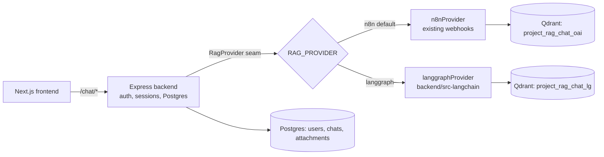
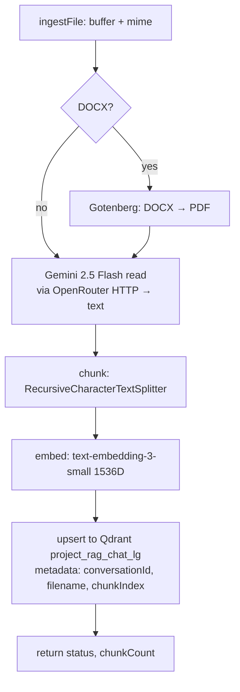
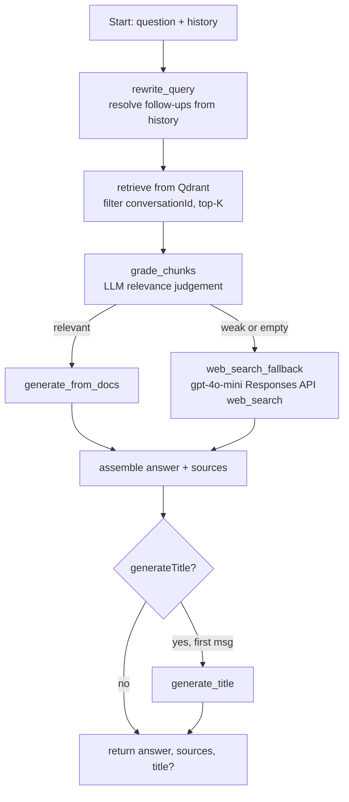
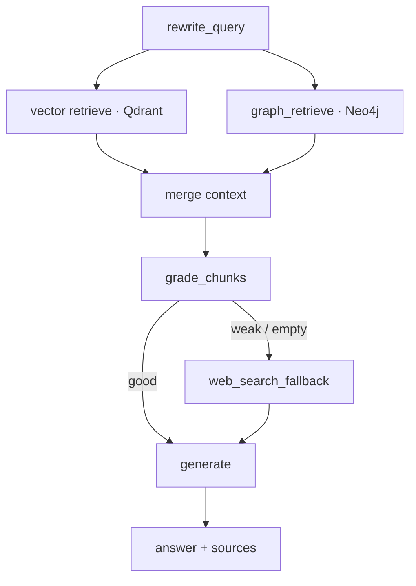

# LangGraph RAG Migration — Design

**Date:** 2026-06-28
**Status:** Design agreed in conversation; written spec pending user review
**Scope:** Replace the n8n RAG layer with a LangChain/LangGraph (JS) implementation, in-process, behind a global provider switch, keeping the existing Postgres/auth/chat backend untouched. v1 is vector-based corrective RAG; **Phase 2 (Section 12)** adds GraphRAG — hybrid vector + knowledge-graph retrieval via a Neo4j graph store.

---

## 1. Background & Goal

Today the backend is a thin Express proxy: all RAG (ingest + query) is delegated to n8n through exactly two functions in `backend/src/rag/n8n-client.ts` (`ingestFile`, `queryRag`). The RAG *recipe* works (Gemini reads the doc → OpenAI embeds → Qdrant → gpt-4o-mini answers), but n8n's **orchestration** has been the recurring source of failure: the double-respond webhook race, the Qdrant vector-name mismatch, and credentials not attaching to httpRequest nodes.

**Goal:** reimplement the RAG pipeline as code we control, using **LangChain/LangGraph JS**, running **in the existing backend process**, while:

1. Keeping the current Postgres app DB (users, sessions, conversations, messages, attachments) **exactly as-is**.
2. Keeping **n8n live as the default** until the new path is proven, via a **global switch**.
3. Cutting over to LangGraph with one config flip, then deleting the n8n path.

**Explicit non-goal:** adopting pipeshub-ai's backend. Pipeshub's RAG is **Python** (FastAPI) bolted to MongoDB + ArangoDB + Kafka + etcd, with **no Postgres** — adopting it would mean a platform swap and discarding our auth/DB. Pipeshub is used here only as a **reference** for retrieval/grading/citation patterns, reimplemented in JS. Its signature feature — knowledge-graph retrieval — is planned as our **Phase 2** (Section 12), reimplemented small in JS rather than adopted wholesale.

---

## 2. Constraints & Principles

- **DB untouched.** LangChain/LangGraph are compute/orchestration libraries, not a datastore. Postgres remains the single source of truth for app data; Qdrant remains the vector store.
- **n8n stays default** until cutover (`RAG_PROVIDER=n8n`).
- **In-process, single deploy.** New code lives in `backend/src-langchain/` (sibling source tree to `backend/src/`), same `package.json`, same process.
- **Minimal blast radius.** The only change to existing `src/` is routing `chat-routes.ts` through a `RagProvider` interface instead of calling `n8n-client` directly.
- **Same models that already work.** Gemini 2.5 Flash for reading (via OpenRouter HTTP), OpenAI `text-embedding-3-small` (1536-D, Cosine) for embeddings, `gpt-4o-mini` via the OpenAI Responses API (with the built-in `web_search` tool) for generation.
- **YAGNI for v1.** No token streaming, no per-conversation provider override, no Drive library. **GraphRAG is explicitly Phase 2** (Section 12) — it consciously relaxes the "Qdrant + Gotenberg only" infra rule by adding one graph-store service, so it is sequenced after v1 ships.

---

## 3. Architecture



- **`RagProvider` interface** is the seam. Two implementations satisfy it; a global env var selects which one `chat-routes.ts` uses.
- **`n8nProvider`** wraps the current `n8n-client.ts` (behavior unchanged).
- **`langgraphProvider`** (new, in `backend/src-langchain/`) implements the same contract using LangChain/LangGraph.
- The two providers write to **separate Qdrant collections** (their payload schemas differ; LangChain's `QdrantVectorStore` owns its own). The LangGraph path uses a **fresh** collection, `project_rag_chat_lg`, with the same embedding model/dims (1536-D, Cosine) so retrieval quality is comparable — only the orchestration differs.

---

## 4. Components

### 4.1 `RagProvider` interface (the seam)

Signatures match the current `n8n-client.ts` exactly, so `chat-routes.ts` changes are minimal:

```ts
interface RagProvider {
  ingestFile(input: {
    conversationId: string;
    filename: string;
    file: Buffer;
    mimeType: string;
  }): Promise<{ status: "ok" | "failed"; chunkCount: number }>;

  queryRag(input: {
    conversationId: string;
    question: string;
    history: { role: "user" | "assistant"; content: string }[];
    generateTitle: boolean;
  }): Promise<{
    answer: string;
    sources: { filename: string; chunkIndex: number; text: string }[];
    title?: string;
  }>;
}
```

Provider selection:

```ts
const provider: RagProvider =
  config.RAG_PROVIDER === "langgraph" ? langgraphProvider : n8nProvider; // default n8n
```

### 4.2 `n8nProvider` (existing)

The current `n8n-client.ts` functions, wrapped to satisfy `RagProvider`. No behavioral change.

### 4.3 `langgraphProvider` (new, `backend/src-langchain/`)

Folder structure (indicative):

```
backend/src-langchain/
  index.ts            // exports langgraphProvider: RagProvider
  ingest/pipeline.ts  // read → chunk → embed → upsert
  query/graph.ts      // the LangGraph state graph
  query/nodes/*.ts    // rewrite, retrieve, grade, generate, web-search, title
  shared/models.ts    // LLM + embeddings clients
  shared/qdrant.ts    // QdrantVectorStore for project_rag_chat_lg
```

The provider stays **DB-agnostic** — it never touches Postgres. All DB writes (messages, attachment status) remain in `chat-routes.ts`, exactly as today.

---

## 5. Ingest pipeline

Accepts the same filetypes as today: **PDF and DOCX** (DOCX → Gotenberg → PDF → Gemini read). MIME validation stays in `chat-routes.ts`.



- **Chunk metadata:** `{ conversationId, filename, chunkIndex }` — same shape n8n uses, so retrieval can filter to the current conversation.
- **Vector store:** LangChain `QdrantVectorStore` owning `project_rag_chat_lg`.

### Async indexing & status (preserve current UX)

The existing `attachments` table already has `status ∈ {indexing, ready, failed}` and a `chunkCount` column, so **no schema change is needed**. To preserve the instant-upload experience and remove the n8n double-respond race:

1. `chat-routes.ts` inserts the attachment as `indexing` and responds immediately.
2. It invokes `provider.ingestFile()` and, on resolve, updates the row to `ready` + real `chunkCount`; on reject, sets `failed`.
3. The provider just does the RAG work and returns `chunkCount` — `chat-routes.ts` owns all status transitions.

**Frontend dependency:** the chat UI must reflect `indexing → ready` (poll or refresh attachment status). If it currently assumes instant-ready, that's a small follow-up task tracked in the plan. The n8n path keeps its current behavior; we do not refactor n8n's async semantics.

---

## 6. Query graph (LangGraph)

v1 decision-making — "corrective RAG": rewrite → retrieve + grade → branch (docs vs web).



**Nodes:**

- **`rewrite_query`** — uses `history` to turn context-dependent questions ("what about the second one?") into standalone retrieval queries.
- **`retrieve`** — `QdrantVectorStore` similarity search over `project_rag_chat_lg`, filtered to `conversationId`, top-K chunks.
- **`grade_chunks`** — LLM judges whether retrieved chunks actually answer the question. Output drives the branch. (This grade→branch cycle is what justifies LangGraph over a plain chain.)
- **`generate_from_docs`** — answer grounded in the retrieved chunks; emits `sources`.
- **`web_search_fallback`** — when docs are weak/empty, answer via `gpt-4o-mini` on the OpenAI Responses API with the built-in `web_search` tool (mirrors today's hybrid behavior).
- **`generate_title`** — only when `generateTitle` is true (first message), matching the current contract; falls back to the existing `titleFromQuestion()` heuristic on failure.

**Output contract:** identical to `queryRag` today — `{ answer, sources, title? }` — so `chat-routes.ts` persistence is unchanged.

**Stretch goal (not v1):** a `grounding_check` node that verifies the draft answer is supported by `sources` and regenerates if not.

---

## 7. Data model & configuration

- **No Postgres schema changes.** `attachments.status` (`indexing/ready/failed`) and `chunkCount` already exist; `messages.sources` already stores the `{filename, chunkIndex, text}` array.
- **New env vars:**
  - `RAG_PROVIDER` = `n8n` (default) | `langgraph`
  - `QDRANT_URL`, `QDRANT_COLLECTION_LG` (= `project_rag_chat_lg`)
  - `OPENAI_API_KEY` (embeddings + generation), `OPENROUTER_API_KEY` (Gemini read)
  - model names (read / embed / generate) as configurable constants

---

## 8. Error handling

- **Ingest failure** (read/embed/upsert throws) → attachment set to `failed`; provider returns `{ status: "failed", chunkCount: 0 }`. Matches current behavior.
- **Query failures:**
  - `grade_chunks` LLM error → degrade gracefully (treat as "weak" → web fallback) rather than failing the request.
  - `web_search` error → return the docs-based answer if available, else a clear error message.
  - generation error → surfaced as an assistant error message; user message is still persisted.
- **Provider isolation:** an exception in `langgraphProvider` never affects auth/session/DB; the request fails cleanly with a 5xx and the conversation state stays consistent.

---

## 9. Build & tooling

- New deps in the backend `package.json`: `@langchain/core`, `@langchain/openai`, `@langchain/community` (Qdrant store), `@langchain/langgraph`, `@langchain/textsplitters`. Removed after cutover if desired.
- `tsconfig` `include` extended to cover `src-langchain` (or a dedicated `tsconfig` extending the base). ESM throughout, matching the existing backend.
- Qdrant client/collection bootstrap (create `project_rag_chat_lg` if missing) on first use.

---

## 10. Testing strategy (TDD)

- **Node-level unit tests** for each graph node (`rewrite_query`, `grade_chunks`, branching, `generate_*`) with mocked LLM/embeddings/Qdrant — assert routing decisions and output shape.
- **Ingest unit tests** with a mocked reader/embedder, asserting chunk metadata and the `status/chunkCount` contract.
- **Integration test:** ingest a small fixture doc into an ephemeral Qdrant collection, then query it end-to-end through `langgraphProvider`, asserting an answer + correct `sources`.
- **Provider parity test:** both providers satisfy the same `RagProvider` contract (shape-level), so `chat-routes.ts` is provider-agnostic.

---

## 11. Migration / cutover plan

1. Build `langgraphProvider` + `project_rag_chat_lg` behind `RAG_PROVIDER` (default stays `n8n`).
2. Test the LangGraph path in dev (flip the flag locally / in staging).
3. **One-time backfill:** re-ingest existing attachments into `project_rag_chat_lg` (the two providers use different collections, so docs ingested under n8n aren't visible to LangGraph until re-ingested).
4. Flip `RAG_PROVIDER=langgraph` in production; monitor.
5. Remove the n8n path: delete `n8nProvider`/`n8n-client.ts`, archive the n8n workflows, reclaim the container.

Once the vector path is stable in production, begin **Phase 2 (GraphRAG, Section 12)** by enabling `GRAPHRAG_ENABLED`.

---

## 12. Phase 2 — GraphRAG (hybrid vector + knowledge-graph retrieval)

Phase 2 augments the vector pipeline with a **knowledge graph**, so the system can answer "how are these connected / multi-hop across documents" questions that pure vector similarity misses. It lives in the same `backend/src-langchain/` module, behind the same `RagProvider`; **Postgres stays untouched**. It adds exactly one new piece of infrastructure: a **graph store**.

### 12.1 Graph store

- **Neo4j (recommended).** Strongest LangChain JS support (`Neo4jGraph`); the Neo4j Browser gives publishable graph visualizations — a real asset for the thesis writeup/demo. One container.
- **FalkorDB** — lighter (Redis-module) with a dedicated `@falkordb/langchain-ts` package; pick this if operational weight matters more than tooling.
- **Postgres + Apache AGE** — no new service, but little LangChain JS support means hand-written Cypher/traversal. Not recommended.
- Vectors stay in **Qdrant**; the graph store holds only nodes/edges. (Neo4j can also store vectors, enabling later consolidation onto one store — out of scope here.)

### 12.2 Ingest additions

After Gemini reads the document text (existing step), a new branch runs alongside the chunk → embed → Qdrant path:

1. **Extract** entities + relationships from the text via an LLM (`LLMGraphTransformer` — experimental in JS; validate quality/cost early).
2. **Upsert** the resulting nodes/edges to the graph store, tagged with `conversationId` / `filename` so graph retrieval is scoped per conversation, mirroring the vector path's metadata filter.

Both paths complete before the attachment is marked `ready`.

### 12.3 Query additions

The query graph gains a `graph_retrieve` node that runs **in parallel** with the existing vector `retrieve`; their results are merged before `grade_chunks` / `generate`. This is **hybrid retrieval** — vector (similarity) + graph (connections) — the right-sized version of pipeshub's approach.



### 12.4 Config & sequencing

- New env: `GRAPH_STORE_URL` (+ credentials), `GRAPHRAG_ENABLED` (default **off**).
- Phase 2 is gated behind `GRAPHRAG_ENABLED` so **Phase 1 ships and cuts over first**; the graph path is enabled only after vector RAG is stable in production.

### 12.5 Phase 2 risks

- **`LLMGraphTransformer` is experimental in JS** — prototype extraction quality early; if it disappoints, fall back to vector-only (the flag stays off) with no loss to Phase 1.
- **Extraction cost/latency** — one extra LLM call per document at ingest.
- **New stateful service** — the graph store must be run and backed up. This is the deliberate trade for the capability, and the reason it's a separate phase.

---

## 13. Risks

- **LangChain JS churn / abstraction.** Mitigated by sticking to stable primitives (embeddings, splitter, `QdrantVectorStore`, `ChatOpenAI`) and keeping graph logic in our own nodes.
- **Added latency/cost.** `rewrite_query` + `grade_chunks` add LLM calls per query; `gpt-4o-mini` is cheap, but watch latency. Keep grading lightweight.
- **Gemini read is custom.** No framework loader covers VLM reading; we own that `fetch` to OpenRouter (as today).
- **Backfill window.** Until re-ingest completes at cutover, older docs are only queryable on whichever provider ingested them.

---

## 14. Out of scope / future

- Token streaming to the frontend (LangGraph supports it; `socket.io-client` is already loaded — a natural follow-up).
- Per-conversation provider override (canary testing without global flip).
- `grounding_check` node (stretch).
- Drive library / multi-collection retrieval (separate future track).
