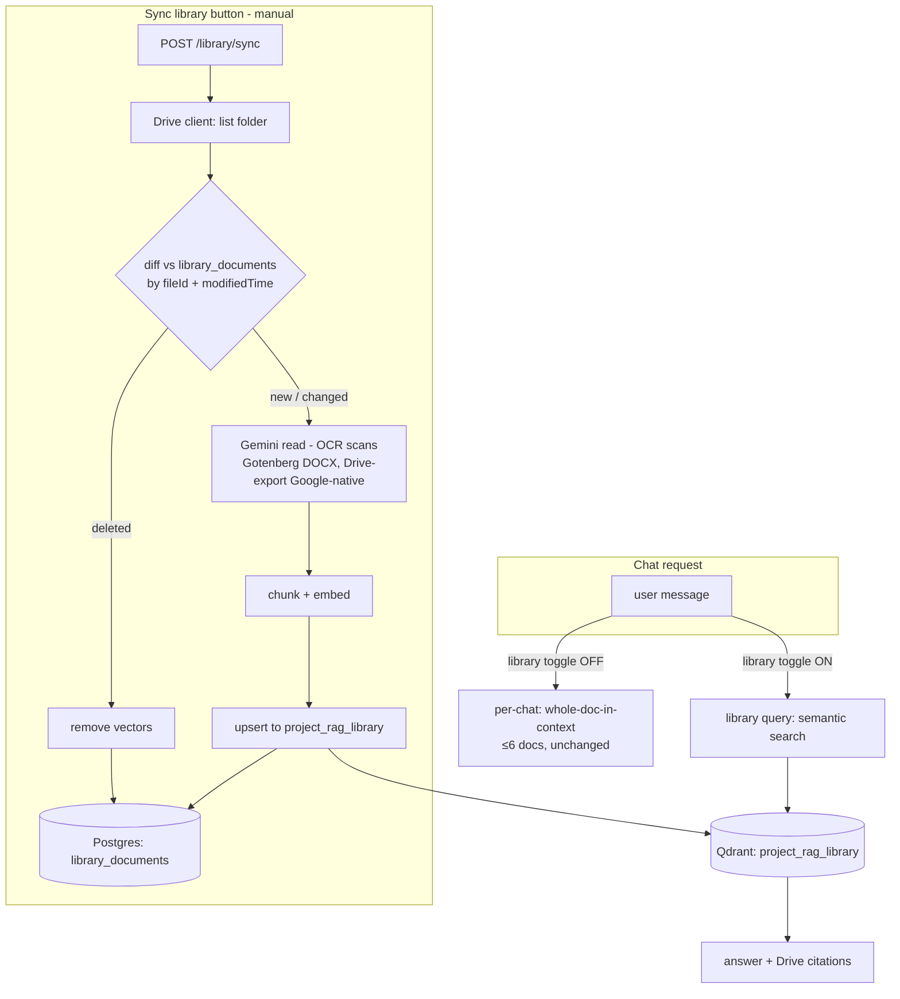

# Phase 2 — Google Drive Library Retrieval — Design

**Date:** 2026-06-29
**Status:** Design agreed in conversation; written spec pending user review
**Scope:** A pre-indexed semantic-retrieval layer over the Google Drive shared library (the org's "enterprise database"), queried on-demand from chat, built in the in-process langgraph backend (off n8n). Distinct from, and additive to, the existing per-chat flow.

---

## 1. Background & Goal

The app has **two tiers of documents**, with fundamentally different needs:

- **Per-chat** (≤ ~6 documents per chat): they fit in the model's context window, so the right design is **whole-doc-in-context** (the model reads the complete documents — no retrieval, no chunking). This already exists and is **unchanged by Phase 2**.
- **Google Drive shared library** (the org's main document store — many DOCX, PDFs, and **scanned paper**): far too large to put in context. This needs **retrieval**, and it is what Phase 2 builds.

**The deciding insight — scanned paper:** an *on-demand* approach (search Drive at query time → read → answer) cannot reliably find scanned documents, because Drive's keyword search can't see inside images and its built-in OCR is unreliable (poor scans, handwriting, non-English). The library is scan-heavy, so on-demand retrieval would **silently miss** relevant documents. The fix is to **read every document once with Gemini vision** (which OCRs scans well) and store that text in a searchable index. That is pre-indexing.

**Goal:** a durable, pre-indexed semantic index of the Drive library in Qdrant, refreshed by a **manual "Sync library" button** (incremental), and queried **only when explicitly invoked** in a chat — answering with citations that link back to the source Drive document. This replaces the n8n on-demand Drive flow.

---

## 2. Constraints & Principles

- **Two stores stay separate.** Per-chat uploads (Postgres bytes + whole-doc-in-context) never enter the library index; the library index is never touched by per-chat activity.
- **Only Sync writes the index; querying is read-only.** The index persists in Qdrant and is reused across all chats until the next Sync.
- **Incremental sync.** Re-reading a doc only happens when it's new or its Drive `modifiedTime` changed; unchanged docs are skipped; deleted docs have their vectors removed. The first sync is the only full read.
- **Manual sync now, scheduled later** (deferred). **Dense-only retrieval now, hybrid/sparse later** (deferred). **No Neo4j/GraphRAG.**
- **Single shared corpus.** The library is one org-wide collection; any authenticated app user can query all of it. No per-user document ACLs (out of scope — see §9).
- **Reuse Phase 1** wherever possible: the Gemini reader, Gotenberg, OpenAI embeddings, the Qdrant client, and the LangGraph query pattern.
- **Behind a flag, gradual cutover** — like Phase 1: build it, validate, then retire the n8n Drive flow.

---

## 3. Architecture

Two independent subsystems: the **Sync pipeline** (writes the index) and the **library query** (reads it). They communicate only through the durable Qdrant collection + a Postgres sync-state table.

---

## 4. Components

### 4.1 Drive client (`src-langchain/library/drive.ts`)
Wraps the Google Drive API (Node `googleapis`, service-account auth). Responsibilities:
- `listFolder(folderId)` → paginated `{ fileId, name, mimeType, modifiedTime, webViewLink }[]` (recurse into subfolders if present).
- `download(fileId, mimeType)` → `Buffer`. For binary files (PDF/DOCX/images): `files.get({alt:'media'})`. For **Google-native** files (Docs/Sheets/Slides): `files.export(...)` to PDF first.
- Depends on: a Google **service account** with read access to the shared folder, and `DRIVE_FOLDER_ID`.

### 4.2 Reader (reuse Phase 1 `ingest/read.ts`, extended)
- PDF / images / scanned → **Gemini vision directly** (OCR).
- DOCX / XLSX / PPTX → **Gotenberg → PDF → Gemini**.
- Google-native → exported to PDF by the Drive client (4.1), then Gemini.
- Phase 1's reader currently handles PDF + DOCX; Phase 2 extends it to images and Office formats (the "multi-filetype" reader). One shared `readDocument(buffer, mimeType)`.

### 4.3 Sync orchestrator (`src-langchain/library/sync.ts`)
Incremental sync (see §6). Reads the Drive listing, diffs against `library_documents`, and for each new/changed file runs read → chunk → embed → upsert; removes vectors for deleted files; returns a summary `{ added, updated, deleted, skipped, failed }`. **Per-file failures are isolated** — a bad file is logged and skipped, the sync continues.

### 4.4 Library Qdrant collection `project_rag_library`
Dense vectors, OpenAI `text-embedding-3-small` (1536-D, cosine) — same model as Phase 1 so the embedding stack is shared. Separate collection from per-chat (`project_rag_chat_lg`). Payload metadata per chunk: `{ driveFileId, filename, webUrl, chunkIndex, modifiedTime }`.

### 4.5 Postgres `library_documents` table (sync state)
One row per indexed Drive file, so deltas are computable and the UI can list/inspect the library. Columns: `driveFileId` (PK), `filename`, `mimeType`, `modifiedTime`, `chunkCount`, `status` (`indexed | failed`), `webUrl`, `indexedAt`, `lastError` (nullable). This is the source of truth for "what's already indexed and at what version."

### 4.6 Library query (`src-langchain/library/query.ts`)
Embeds the question → Qdrant semantic search over `project_rag_library` (top-K, **no conversation filter** — it's the shared corpus) → builds context from the retrieved chunks → generates an answer with `gpt-4o-mini`, reusing Phase 1's generate node and §8 degradation. Returns `{ answer, sources }` where each source carries the Drive `filename` + `webUrl` for a clickable citation.

### 4.7 Backend (existing Express `src/`)
- `POST /library/sync` — triggers a sync; returns the summary. Admin-gated (only admins re-index the org library).
- `GET /library/status` — last sync time, indexed doc count, any failures (for the UI).
- The chat message endpoint gains a **`useLibrary: boolean`** flag; when true, that message is answered from the library (semantic retrieval) instead of the per-chat flow. The flag is per-message, so a user can mix library and per-chat turns within one conversation.

### 4.8 Frontend
- A **"Sync library"** button (admin view) that calls `POST /library/sync` and shows the summary + `GET /library/status`.
- A **library toggle** in the chat composer; when on, sends `useLibrary: true`.
- Citations render as links to the Drive `webUrl`.

---

## 5. Data model & configuration

**Qdrant:** new collection `project_rag_library` (1536-D, cosine).

**Postgres:** new `library_documents` table (4.5). Drizzle migration; no changes to existing tables.

**New env/config:**
- `DRIVE_FOLDER_ID` — the shared library folder.
- `GOOGLE_SERVICE_ACCOUNT_JSON` (or a key-file path) — Drive auth.
- `QDRANT_COLLECTION_LIBRARY` (= `project_rag_library`).
- Reused from Phase 1: `QDRANT_URL`, `OPENAI_API_KEY`, `OPENROUTER_API_KEY`, `GOTENBERG_URL`, model names.

---

## 6. Sync flow (incremental)

1. `listFolder(DRIVE_FOLDER_ID)` → current Drive files (id, name, mimeType, modifiedTime, webUrl).
2. Load `library_documents`. Classify each current file:
   - **New** (id not in table) → index.
   - **Changed** (`modifiedTime` newer than the row's) → re-index: delete existing vectors for that `driveFileId`, then index fresh.
   - **Unchanged** → skip.
3. Files in `library_documents` but **absent from Drive** → **deleted**: remove their vectors + their table row.
4. For each file to index: `download/export` → `readDocument` → chunk (`RecursiveCharacterTextSplitter`) → embed → upsert to `project_rag_library` with metadata → upsert the `library_documents` row (`status:"indexed"`, `chunkCount`, `modifiedTime`, `indexedAt`). On failure: record `status:"failed"` + `lastError`, continue.
5. Return `{ added, updated, deleted, skipped, failed }`.

**Idempotent & resumable:** a file is keyed by `driveFileId`; re-running Sync after a partial failure simply re-processes the files still marked `failed`/stale and skips the rest.

---

## 7. Query flow (only when invoked)

1. Chat message arrives with `useLibrary: true`.
2. Embed the question (`text-embedding-3-small`).
3. Qdrant `similaritySearch` over `project_rag_library`, top-K (e.g. 8), no conversation filter.
4. Build context from the retrieved chunks; generate with `gpt-4o-mini` (reuse Phase 1's generate node + §8 degradation; web-search fallback optional).
5. Return `{ answer, sources }`; persist the turn like any chat message. Sources include `{ filename, webUrl, chunkIndex, text }` so the UI links to the Drive doc.

---

## 8. Error handling

- **Sync:** per-file isolation (one bad file never aborts the run); Drive API pagination + rate-limit/backoff; failed files retried on the next Sync; the summary surfaces `failed` count + reasons.
- **Query:** reuses Phase 1's §8 graceful degradation (no LLM-node throw → no 502); empty retrieval → a clear "nothing relevant found in the library" answer rather than a hallucinated one.
- **Drive auth failure:** `POST /library/sync` returns a clear error; never partially corrupts the index (deletes happen per-file, upserts are keyed).

---

## 9. Security

- Drive **service account scoped to the single shared folder** (least privilege).
- The library is a **single org-wide corpus**: any authenticated app user who toggles it can query any indexed document. There is **no per-user document-level permission filtering** (pipeshub's permissions-graph use case) — this is acceptable for a single-org app and is explicitly out of scope.
- `POST /library/sync` is **admin-only** (re-indexing the org library is an admin action).
- Citations expose Drive `webUrl`s — fine, since the library is shared.

---

## 10. Testing strategy (TDD)

- **Drive client:** mock `googleapis`; assert listing pagination, the export-vs-download branch for Google-native vs binary.
- **Sync delta logic:** unit-test classification (new / changed / unchanged / deleted) against a fake Drive listing + a seeded `library_documents`; assert the right files are indexed/removed/skipped and per-file failure isolation.
- **Reader extension:** image + Office paths (mock Gemini/Gotenberg).
- **Library query:** mock embeddings + Qdrant; assert top-K search over the library collection and citation mapping.
- **Integration:** seed a fake Drive + ephemeral Qdrant collection → Sync → query → assert a grounded answer with the right Drive citation; re-Sync with one changed + one deleted file → assert incremental behavior.

---

## 11. Phasing within Phase 2

Two independently-shippable milestones:
- **2a — Sync pipeline:** Drive client + reader extension + `library_documents` + sync orchestrator + `project_rag_library` + `POST /library/sync` + the Sync button. Deliverable: a populated, inspectable library index.
- **2b — Library query:** the library query node + `useLibrary` chat flag + the chat toggle + citations. Deliverable: ask-the-library in chat.

2a is testable on its own (inspect the index / `GET /library/status`); 2b builds on it.

---

## 12. Migration / relationship to n8n

This replaces the n8n on-demand Drive retrieval flow. Build behind a flag (library disabled until configured); validate Sync + query against the real Drive folder; then retire the n8n Drive subflow. Per-chat and Phase 1 are unaffected.

---

## 13. Risks

- **First-sync cost/time:** the initial full read OCRs every scanned doc via Gemini — potentially slow and token-heavy for a large library. Mitigate: run it once, off-hours; show progress; it's incremental thereafter.
- **Drive API quotas / large folders:** pagination + backoff; consider a per-run file cap with continuation.
- **Embedding/index cost** scales with corpus size (one-time per doc).
- **Staleness between manual syncs:** acceptable by design (enterprise docs change slowly); scheduled sync is the deferred mitigation.
- **Google-native fidelity:** exporting Docs/Sheets/Slides to PDF may lose some structure; acceptable for retrieval.

---

## 14. Out of scope / future / known open items

- **Sparse/hybrid (dense+sparse) retrieval** — dense-only now; add BM25/sparse fusion later if recall needs it (pipeshub's real quality lever).
- **Scheduled auto-sync** and **Drive change-webhooks** — manual button now.
- **Neo4j / GraphRAG** — only if multi-hop relationship reasoning is ever needed.
- **Per-user document ACLs** — single shared corpus for now.
- **Known open item (separate from this spec):** Phase 1's per-chat langgraph path does chunk/embed/retrieve, which diverges from the current per-chat *whole-doc-in-context* model. Whether to realign Phase 1's per-chat to whole-doc is a **separate decision**, tracked but not part of Phase 2.
